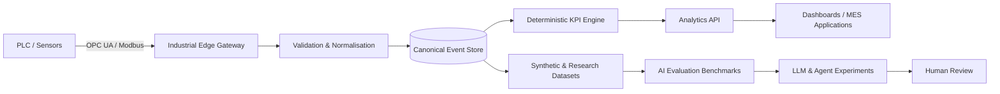

# Industrial AI Toolkit

<p align="center">
  <strong>Open-source building blocks for trustworthy Industrial AI, smart manufacturing and modern MES architectures.</strong>
</p>

<p align="center">
  <a href="https://github.com/yacine-ibr/industrial-ai-toolkit/actions"></a>
  <a href="LICENSE"></a>
  <a href="https://www.python.org/"></a>
  <a href="CONTRIBUTING.md"></a>
</p>

---

## Why this project exists

Industrial teams generate enormous volumes of machine, quality, production and maintenance data, yet this information is often fragmented across PLCs, SCADA systems, historians, spreadsheets, MES platforms and proprietary vendor tools.

The **Industrial AI Toolkit** is an open-source research and engineering project that turns those fragmented signals into reproducible datasets, transparent analytics and safe AI experiments.

The project focuses on practical manufacturing problems:

- collecting deterministic telemetry from industrial equipment;
- simulating realistic production and downtime scenarios;
- calculating OEE and related manufacturing KPIs transparently;
- building traceability-ready event models;
- evaluating LLM and agent behaviour on industrial tasks;
- documenting architectures that connect OT systems to modern data platforms;
- enabling research without requiring access to a real factory.

This repository is intentionally vendor-neutral and designed for engineers, researchers, students, manufacturers and open-source contributors.

## Project principles

1. **Safety before novelty** — examples must never encourage unsafe control of physical equipment.
2. **Deterministic analytics** — every KPI should be explainable, testable and reproducible.
3. **Synthetic by default** — sample datasets contain no confidential plant or customer data.
4. **Human-in-the-loop AI** — AI outputs are advisory unless explicitly validated by qualified personnel.
5. **Interoperability** — models should map cleanly to OPC UA, Modbus, MQTT, REST and common MES concepts.
6. **Research transparency** — benchmarks must describe assumptions, limitations and failure modes.

## What is included

| Area | Purpose | Status |
|---|---|---|
| Synthetic factory generator | Produce realistic machine-state and production events | Initial implementation |
| OEE engine | Calculate availability, performance, quality and OEE | Initial implementation |
| Industrial event model | Canonical schema for telemetry, downtime, production and quality | Documented |
| AI evaluation framework | Define tasks and metrics for industrial assistants | Planned |
| OPC UA examples | Safe read-only integration patterns and simulator examples | Planned |
| Modbus examples | Defensive polling and register-mapping examples | Planned |
| Traceability analytics | Lot-centric production and quality analysis | Planned |
| Reference architectures | Edge-to-cloud and MES/AI patterns | Documented |

## Architecture



The repository does **not** provide autonomous control logic for production equipment. Integration examples are intended for simulation, read-only acquisition or explicitly isolated test environments.

## Quick start

### Requirements

- Python 3.11 or newer
- Git

### Installation

```bash
git clone https://github.com/yacine-ibr/industrial-ai-toolkit.git
cd industrial-ai-toolkit
python -m venv .venv
source .venv/bin/activate  # Windows: .venv\Scripts\activate
pip install -e ".[dev]"
```

### Generate a synthetic production dataset

```bash
industrial-ai generate --minutes 480 --seed 42 --output data/sample_shift.jsonl
```

### Calculate OEE from Python

```python
from industrial_ai_toolkit.oee import OEEInputs, calculate_oee

result = calculate_oee(
    OEEInputs(
        planned_production_seconds=28_800,
        downtime_seconds=2_100,
        ideal_cycle_seconds=1.2,
        total_count=19_400,
        good_count=18_950,
    )
)

print(result.oee)
print(result.as_percentages())
```

### Run tests

```bash
pytest
```

## Repository structure

```text
industrial-ai-toolkit/
├── .github/                 # CI and contribution templates
├── docs/                    # Architecture, safety and research documentation
├── examples/                # Executable usage examples
├── src/industrial_ai_toolkit/
│   ├── cli.py               # Command-line interface
│   ├── generator.py         # Synthetic factory event generation
│   ├── models.py            # Canonical industrial event models
│   └── oee.py               # Deterministic OEE calculations
├── tests/                   # Automated tests
├── CONTRIBUTING.md
├── ROADMAP.md
├── SECURITY.md
└── pyproject.toml
```

## Research tracks

### 1. Industrial telemetry and interoperability

Research and examples around OPC UA information models, Modbus register mapping, edge buffering, timestamp quality, idempotency, clock drift and data-health indicators.

### 2. Manufacturing analytics

Transparent implementations of OEE, downtime Pareto analysis, production-rate analysis, lot genealogy, quality loss attribution and machine-state timelines.

### 3. Trustworthy LLMs for manufacturing

Evaluation of assistants that answer questions about industrial data, generate investigation plans, explain abnormal production conditions and create charts from validated datasets.

Candidate evaluation dimensions include:

- factual accuracy;
- grounding in supplied data;
- numerical correctness;
- uncertainty calibration;
- refusal to invent missing production facts;
- safety awareness;
- traceability of conclusions;
- resistance to prompt injection in operational documents.

### 4. Synthetic industrial datasets

Factories rarely publish operational datasets because of confidentiality, cybersecurity and commercial constraints. This toolkit therefore prioritises configurable synthetic data with explicit scenario labels and deterministic seeds.

## Example research questions

- How accurately can an LLM explain an OEE loss tree without fabricating causes?
- Which event schema best supports both deterministic MES analytics and natural-language querying?
- How should missing, stale or contradictory sensor values be represented to an AI assistant?
- Can synthetic downtime scenarios provide useful benchmarks for root-cause investigation?
- What human approval boundaries are necessary before an AI recommendation affects production?

## Responsible use

Industrial environments are safety-critical. Never connect experimental code directly to production control networks without formal review, segregation, cybersecurity assessment and plant authorisation.

See [docs/SAFETY.md](docs/SAFETY.md) for the project safety model and [SECURITY.md](SECURITY.md) for vulnerability reporting.

## Roadmap

The high-level roadmap is available in [ROADMAP.md](ROADMAP.md). Near-term priorities are:

1. stabilise the canonical event schema;
2. expand synthetic scenarios and validation tests;
3. publish reference datasets with data cards;
4. add read-only OPC UA simulator examples;
5. define an industrial assistant benchmark;
6. publish reproducible baseline results.

## Contributing

Contributions are welcome from automation engineers, MES specialists, data engineers, researchers, students and manufacturing practitioners.

Start with [CONTRIBUTING.md](CONTRIBUTING.md), review the [Code of Conduct](CODE_OF_CONDUCT.md), and open an issue before proposing a large architectural change.

Useful contributions include:

- additional synthetic scenarios;
- unit tests and property-based tests;
- documentation corrections;
- data-quality rules;
- benchmark tasks;
- safe interoperability examples;
- translations;
- reproducibility improvements.

## Citation

Academic and technical users can cite this project using the metadata in [CITATION.cff](CITATION.cff).

## License

Licensed under the **Apache License 2.0**. See [LICENSE](LICENSE).

## Project status

This is an early-stage open-source research project. APIs may evolve before the first stable release. The project is independent and is not affiliated with any PLC, SCADA, MES or AI vendor.
